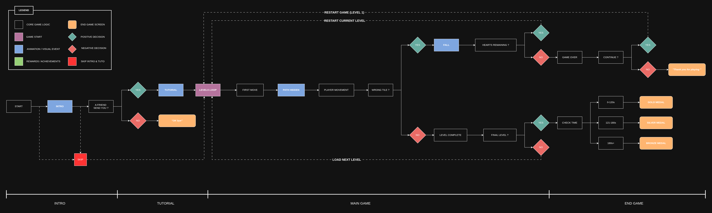

# Who Cut The Lights

<!-- screenshot of the game or a gif ?-->

A memory-based puzzle game developed in Scratch.

## Play the Game

<!-- add a link to scratch mit website or better solution -->

## Gameplay

<!-- Add a GIF -->

- Watch the path appear.
- Memorize it.
- The path disappears.
- Reach the chest without stepping on the wrong tile.
- Complete all 9 levels.
- Earn Gold, Silver, or Bronze medals based on completion time.

## Game Flow

*Click the diagram to view the full-size version.*

## Game Features

- 9 levels
- Heart system
- Timer and medals
- Game Over flow
- Skip intro system
- Level restart logic

## Technical Challenges

- Timer synchronization system
- Heart/life handling after falls
- Game over state issues
- Intro skipping logic
- Level Progression
- Debugging large Scratch projects

## What I have learn

...